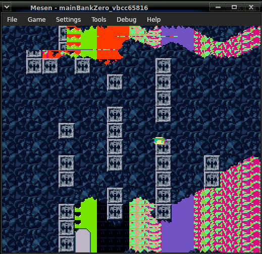

# Cave Story SNES


Work in progress SNES port of [Cave Story MD by andwn](https://github.com/andwn/cave-story-md)
## Compilation
1. Setup [vbcc](http://www.ibaug.de/vbcc/vbcc65816_r2.zip) and [PVSnesLib](https://github.com/alekmaul/pvsneslib/releases/tag/4.5.0)
  - Make sure environment variables VBCC (pointing to the folder containing bin,config,targets), PVSNESLIB_HOME are setup and that vbcc/bin is in your PATH.
2. Clone & `make -j8; `
## License
[flipphone22's compiler setup (MIT)](https://github.com/Phillip-May/snes-homebrew/blob/master/LICENSE)
[Cave Story MD (MIT and others)](https://github.com/andwn/cave-story-md/blob/master/doc/LICENSE.md)
## Thanks
- andwn: Took on the insane task of porting this game to a 1988 console, this project would not exist without.
- flipphone22: Compiler & build setup
- livvy94: Cave Story SNES Soundtrack
- vbcc
- PVSnesLib
- Pixel

Cave Story MD thanks:

```
I did not know how to sort this list, so I did it alphabetically.

- andwhyisit: A whole lot of testing. Automated builds.
- DavisOlivier: Helped with a few music tracks.
- Sik: Mega Drive tech support. Made the font used in-game.
- Other people I probably forgot
```